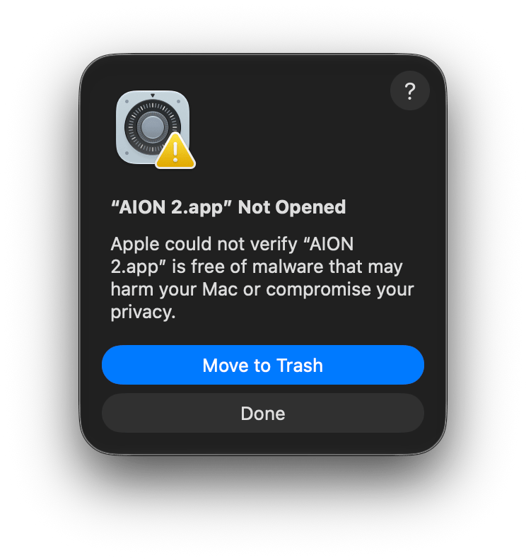
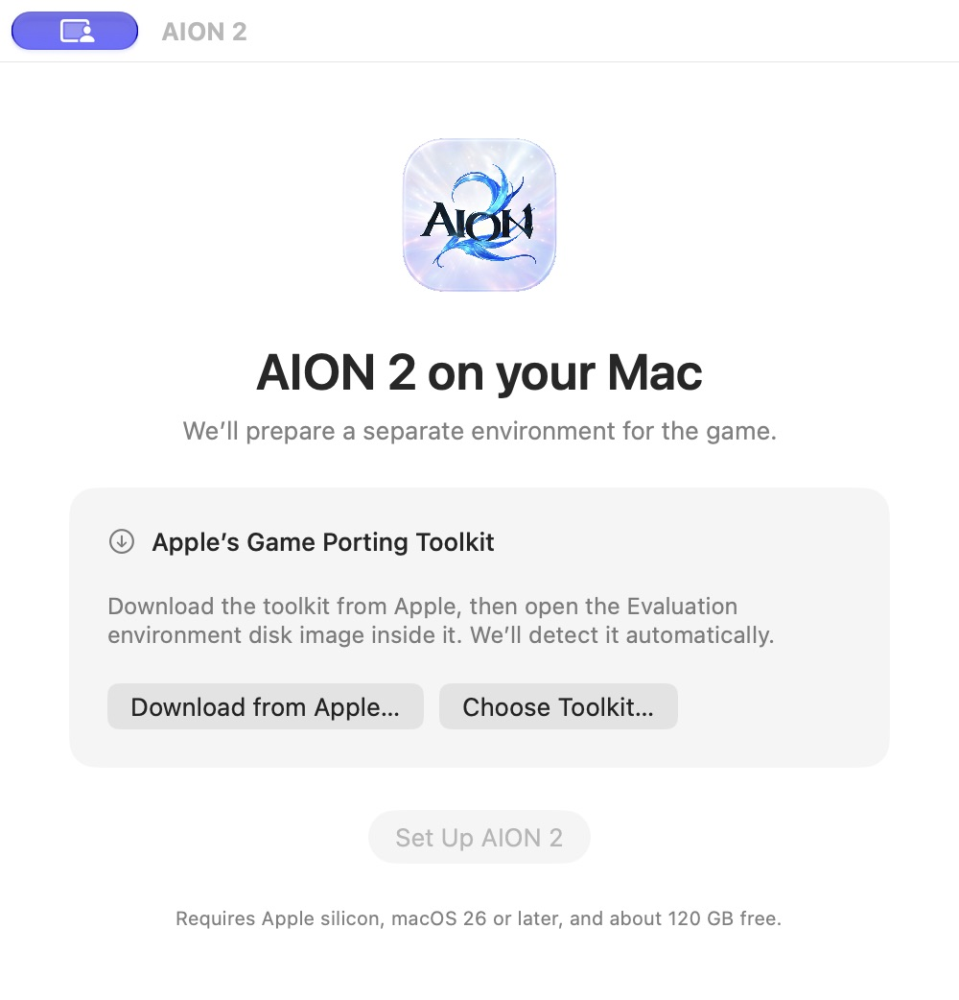
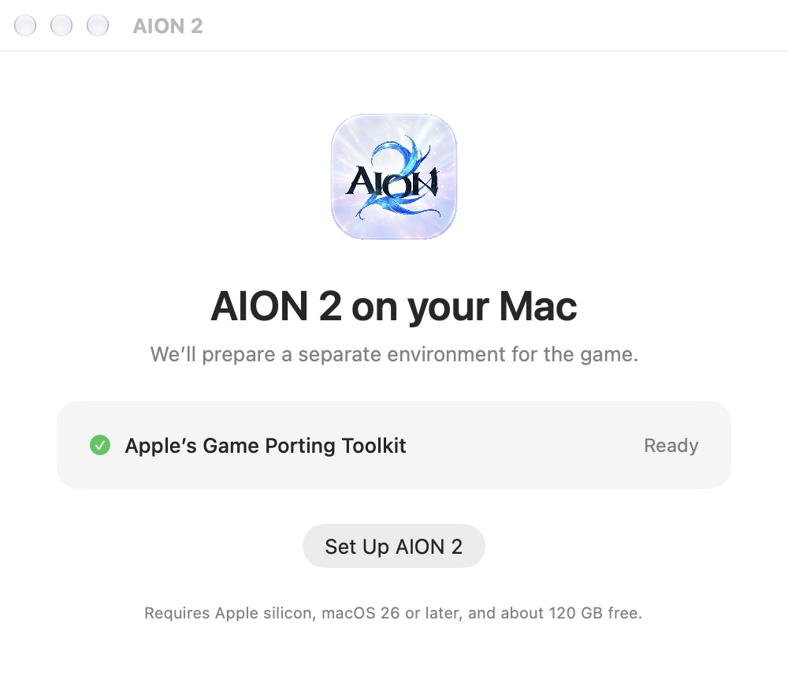
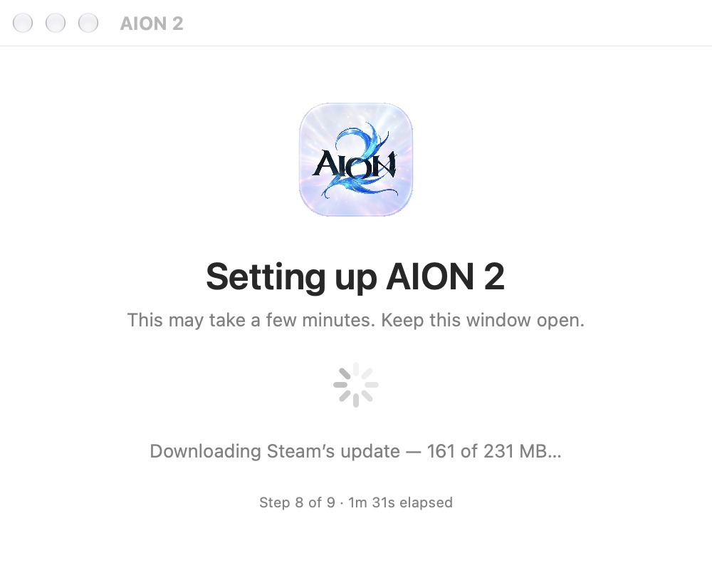
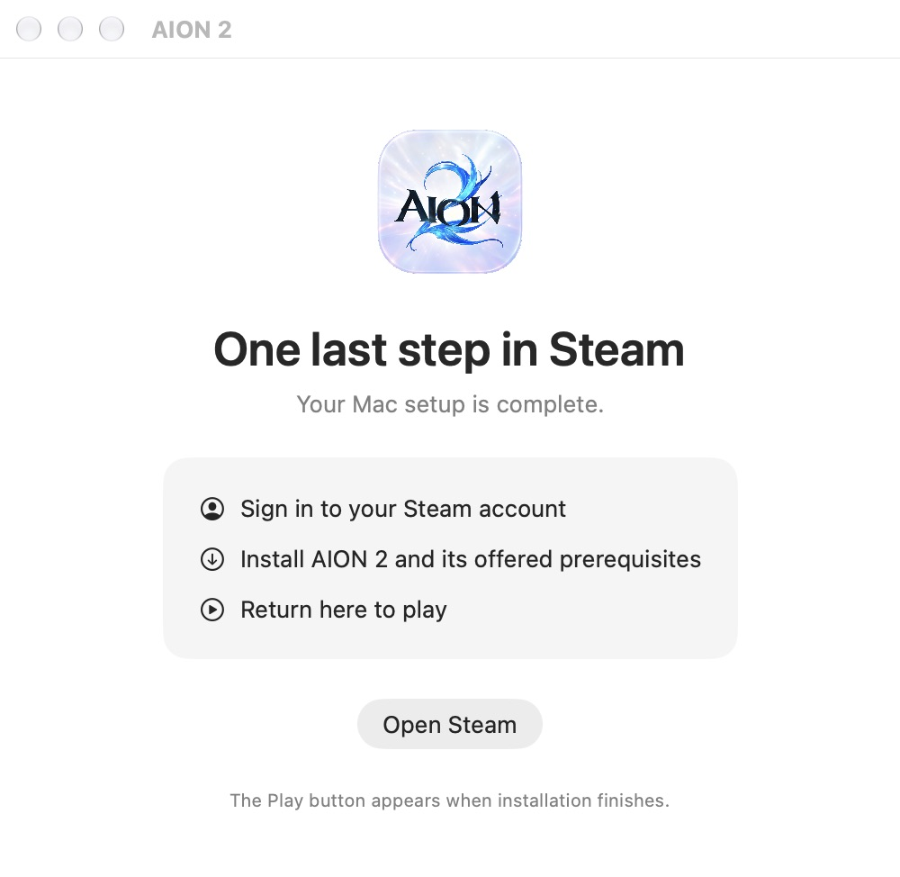
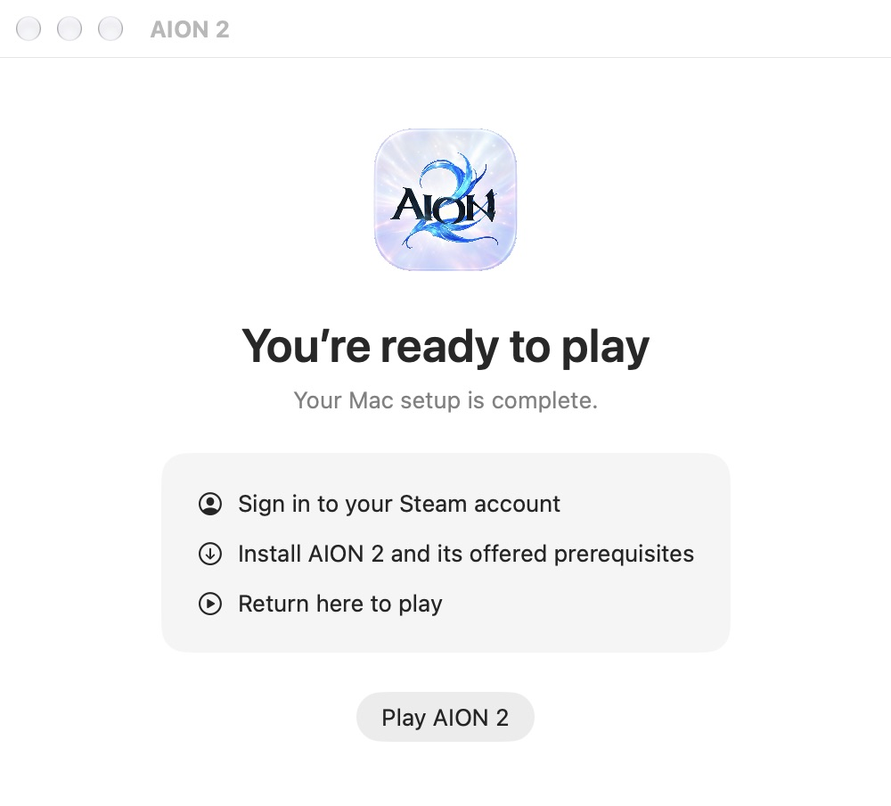

# AION 2 on Mac

Run the Windows Steam version of **AION 2** on Apple silicon with D3DMetal.

This sets up a **Wine bottle**: a separate Windows environment containing Windows Steam, AION 2, and their settings. **AION 2.app** is the native Mac launcher that creates and opens that bottle.

**Experimental preview.** Gameplay, cinematic pictures, and the DLSS menu work on our test Mac. Fullscreen input, cinematic audio, frame generation, and stability still need in-game verification. Version 0.1.5 includes the DLSS loader fix. [Current status →](docs/compatibility.md)

## Get started

You need **Apple silicon, macOS 26 or newer, Rosetta, and about 120 GB free**. Tested on macOS 27 with D3DMetal 4.0 beta 2.

### 1. Open the app and get Apple’s toolkit

[Download AION 2.app](https://github.com/xenios-jp/aion2-mac/releases/download/v0.1.5/AION-2-Mac-v0.1.5.zip), unzip it, and drag it into **Applications**. Open the app, then click **Download from Apple…**. Download Apple’s toolkit and open the **Evaluation environment** disk image inside it. The app detects it automatically.

<details>
<summary>macOS says “AION 2.app Not Opened”?</summary>

This preview is not notarized yet. Click **Done**, then **System Settings → Privacy & Security → Open Anyway** for AION 2. Complete macOS’s confirmation and reopen the app. [First-open help](docs/troubleshooting.md#macos-blocks-the-app).



</details>



If Rosetta is missing, the app offers **Install Rosetta…**. Complete Apple’s installation window, then return here.

### 2. Set up and let the updates finish

When the toolkit says **Ready**, click **Set Up AION 2**. Keep the window open while it prepares the bottle, graphics and video support, and Steam. Steam’s initial client updates happen here too; this can take several minutes.

| Toolkit detected | Setup in progress |
| --- | --- |
|  |  |

*Screens captured from the app’s setup UI. The progress values shown are illustrative; your download size and timing will vary.*

### 3. Install in Steam, then play

Click **Open Steam**, sign in, and install **AION 2** and its offered prerequisites. Return to this window: **Play AION 2** appears once installation finishes. Click it to start the game. Future app launches go straight to your installed game, with Steam in the background.

| Finish installation in Steam | Ready to play |
| --- | --- |
|  |  |

Closed Steam before finishing? Use **Open Steam Again** in the setup window. [Troubleshooting](docs/troubleshooting.md).

**Updating from an earlier version?** Replace the old app with 0.1.5 and open it. It refreshes the launcher scripts and reuses your installed game and settings. Terminal users can rerun the command below to update the same bottle.

<details>
<summary>Prefer Terminal?</summary>

Mount Apple’s Evaluation environment first, then run:

```bash
curl -fsSL https://raw.githubusercontent.com/xenios-jp/aion2-mac/v0.1.5/install.sh | bash
```

With the default location, the script creates the bottle and a Mac launcher, adds a shortcut on your Desktop when available, and opens the launcher. You do **not** need to download the app separately or drag anything into Applications. You can optionally copy the generated **AION 2.app** into Applications afterward.

</details>

### Where everything lives

**Both setup methods use the same bottle location.** The bottle lives separately from the Mac app, so moving the app into Applications does not move the game.

| Setup method | Mac launcher | Bottle |
| --- | --- | --- |
| Download the release ZIP | Unzip and drag **AION 2.app** into **Applications** (recommended), then open it to run setup | `~/Library/Application Support/Aion2Mac/prefix` |
| Run the Terminal command | Created at `~/Library/Application Support/Aion2Mac/AION 2.app`, with a Desktop shortcut when available; copying it into Applications is optional | `~/Library/Application Support/Aion2Mac/prefix` |

`~` means your home folder. In Finder, choose **Go → Go to Folder…** and paste `~/Library/Application Support/Aion2Mac` to see the bottle, runtime, and support files. A completed installation at this location is reused by either setup method; you do not need two bottles. Other Wine or CrossOver bottles are not automatically imported. [More options](docs/usage.md#where-the-bottle-lives).

The release ZIP contains the launcher, which creates the bottle on first setup. Apple’s libraries, game files, and account data are supplied through their official interfaces.

## After setup

- **Play:** open AION 2.app. Steam runs in the background.
- **Keep it in the Dock:** drag **AION 2.app** from Applications into the Dock. The game’s temporary Dock entry disappears when the game closes; your pinned launcher stays.
- **Change graphics, sound, or controls:** use the game’s own settings. [Advanced launch options](docs/usage.md) are optional.
- **Open Windows Steam separately:** in Finder, go to `~/Library/Application Support/Aion2Mac/scripts` and double-click **steam.command**. Your Mac’s native Steam app uses a separate installation.
- **Update the Mac launcher:** quit AION 2.app, then replace it with the newer release app. It reuses your existing bottle. Replacing the launcher does not by itself upgrade the bottle’s runtime or compatibility fixes.

## Need help?

[Troubleshooting](docs/troubleshooting.md) · [Screenshots](docs/screenshots.md) · [Performance](docs/performance.md) · [Options](docs/usage.md) · [Compatibility](docs/compatibility.md)

Still stuck? [Report a problem](https://github.com/xenios-jp/aion2-mac/issues/new?template=bug.yml) with your Mac model, app version, and the step where it happened. [How to collect diagnostics](docs/troubleshooting.md#diagnostics-and-removal).

## Credits

Built on [WineCX](https://github.com/dappermint/winecx-gptk), [Wine](https://www.winehq.org/), Apple’s Game Porting Toolkit, [winevideo](https://github.com/Jfishin/winevideo/wiki/UE5-ElectraPlayer), and [notpop’s Steam wrapper](https://github.com/notpop/steam-on-m1-wine).

Project code is MIT licensed; Wine changes are LGPL-2.1-or-later. [Licenses and sources](THIRD_PARTY.md). No game files, Apple binaries, account data, or anti-cheat bypass are included.
