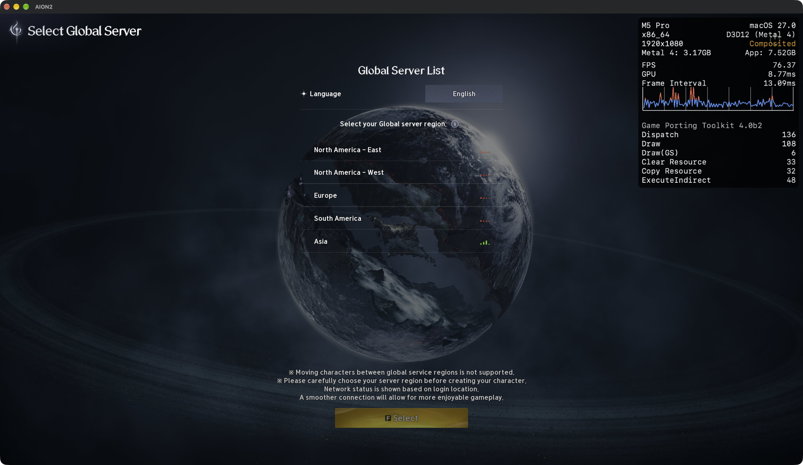
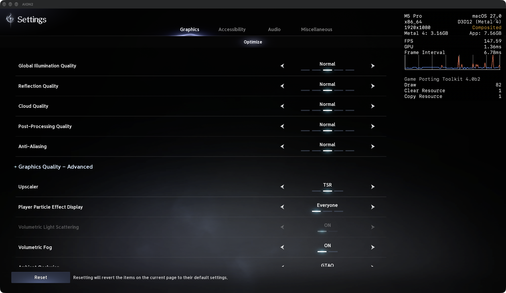
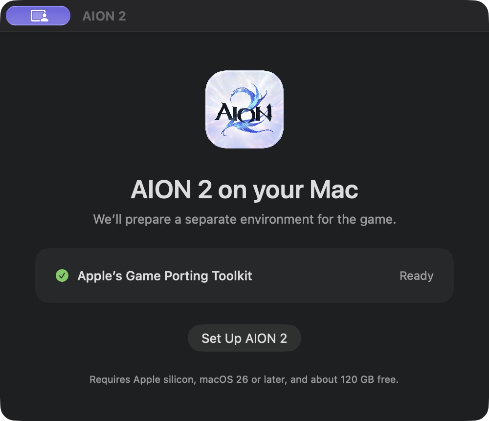

# AION 2 on Mac — screenshots

M5 Pro · macOS 27.0.1 · GPTK 4.0 beta 2 · D3DMetal / Metal 4 · 1920×1080 windowed.

## Server selection

## Graphics settings

Unedited window captures from 2026-10-08. The HUD shows Composited, which is expected in windowed mode. The FPS readings are momentary menu values, not gameplay benchmark results. See [performance notes](performance.md).

## Native setup

The first-run app detects the mounted toolkit and prepares an isolated environment without opening Terminal.

